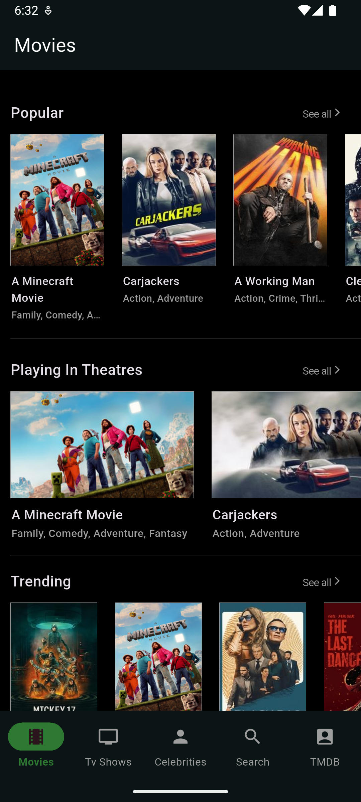
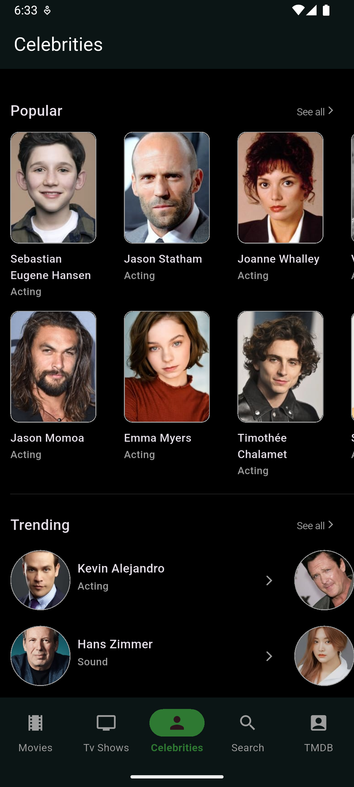
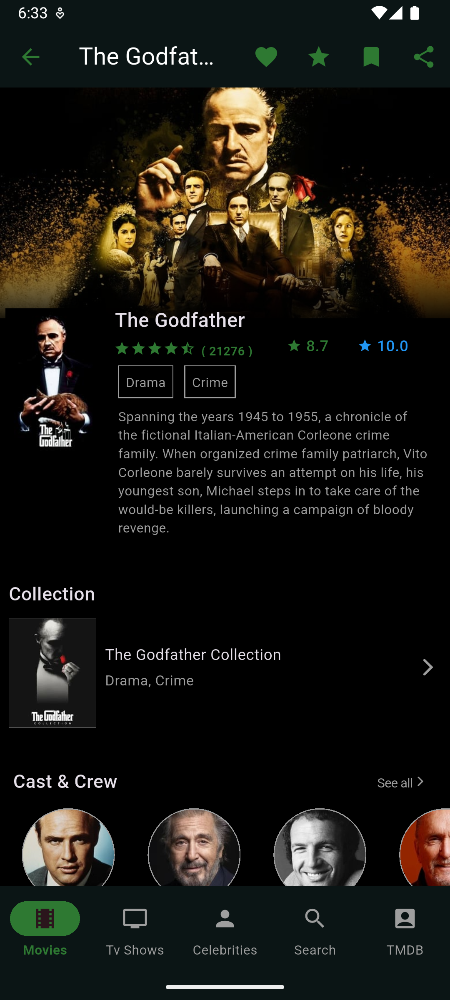

# TMDb App

TMDb is a cross-platform application developed using the Flutter framework that uses the https://www.themoviedb.org API 
to fetch Movies, TV shows, Celebrities, etc, information.

***Security***
- The API key is stored in the Google Cloud Secret Manager, and all the requests are made through Firebase Cloud Functions, which prevents hackers from accessing the API key by reverse engineering the APK, as the API key is not embedded in the APK.
- Firebase App Check is enabled, which only allows APK or app bundle signed by only developer Google Play Signing key to make requests to Firebase Cloud Functions to avoid misuse.

  
**App ScreenShots**
                                  
&nbsp;&nbsp;&nbsp;&nbsp;&nbsp;&nbsp;&nbsp;&nbsp;&nbsp;&nbsp;&nbsp;&nbsp;

&nbsp;&nbsp;&nbsp;&nbsp;&nbsp;&nbsp;&nbsp;&nbsp;&nbsp;&nbsp;&nbsp;&nbsp;

&nbsp;&nbsp;&nbsp;&nbsp;&nbsp;&nbsp;

# License

Copyright (c) 2020 IRFAN GujjAR

http://www.apache.org/licenses/LICENSE-2.0

Besides the above notice, the following license applies and this license notice must be included in all works derived from this project.

Permission is hereby granted, free of charge, to any person obtaining a copy of this software and associated documentation files (the "Software"), to deal in the Software without restriction, including without limitation the rights to use, copy, modify, merge, publish, distribute, sublicense, and/or sell copies of the Software, and to permit persons to whom the Software is furnished to do so, subject to the following conditions:

The above copyright notice and this permission notice shall be included in all copies or substantial portions of the Software.

THE SOFTWARE IS PROVIDED "AS IS", WITHOUT WARRANTY OF ANY KIND, EXPRESS OR IMPLIED, INCLUDING BUT NOT LIMITED TO THE WARRANTIES OF MERCHANTABILITY, FITNESS FOR A PARTICULAR PURPOSE AND NONINFRINGEMENT. IN NO EVENT SHALL THE AUTHORS OR COPYRIGHT HOLDERS BE LIABLE FOR ANY CLAIM, DAMAGES OR OTHER LIABILITY, WHETHER IN AN ACTION OF CONTRACT, TORT OR OTHERWISE, ARISING FROM, OUT OF OR IN CONNECTION WITH THE SOFTWARE OR THE USE OR OTHER DEALINGS IN THE SOFTWARE.

